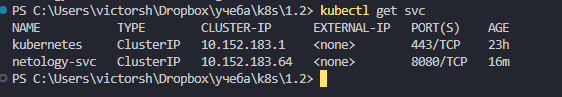

# Домашнее задание к занятию «Базовые объекты K8S»

### Цель задания

В тестовой среде для работы с Kubernetes, установленной в предыдущем ДЗ, необходимо развернуть Pod с приложением и подключиться к нему со своего локального компьютера. 

------
### Решение

### Задание 1. Создать Pod с именем hello-world

1. Создать манифест (yaml-конфигурацию) Pod.
2. Использовать image - gcr.io/kubernetes-e2e-test-images/echoserver:2.2.  
манифест
[Pod с именем hello-world](./files/hello-world.yaml)  

вывод kubectl get pods  
  

3. Подключиться локально к Pod с помощью `kubectl port-forward` и вывести значение (curl или в браузере).

port-forward  
  

curl  
  

------

### Задание 2. Создать Service и подключить его к Pod

1. Создать Pod с именем netology-web.
2. Использовать image — gcr.io/kubernetes-e2e-test-images/echoserver:2.2.  
манифест  
[Pod с именем netology-web](./files/netology-web.yaml)  
3. Создать Service с именем netology-svc и подключить к netology-web.  
манифест  
[Pod с именем netology-web](./files/netology-svc.yaml)  

вывод kubectl get pods  
  

вывод kubectl get svc  
    
4. Подключиться локально к Service с помощью `kubectl port-forward` и вывести значение (curl или в браузере).
port-forward  
![port-forward][(./images/2-1.png)  

curl  
    

------

### Правила приёма работы

1. Домашняя работа оформляется в своем Git-репозитории в файле README.md. Выполненное домашнее задание пришлите ссылкой на .md-файл в вашем репозитории.
2. Файл README.md должен содержать скриншоты вывода команд `kubectl get pods`, а также скриншот результата подключения.
3. Репозиторий должен содержать файлы манифестов и ссылки на них в файле README.md.

------

### Критерии оценки
Зачёт — выполнены все задания, ответы даны в развернутой форме, приложены соответствующие скриншоты и файлы проекта, в выполненных заданиях нет противоречий и нарушения логики.

На доработку — задание выполнено частично или не выполнено, в логике выполнения заданий есть противоречия, существенные недостатки.
