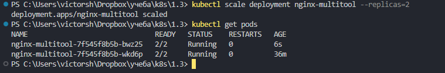
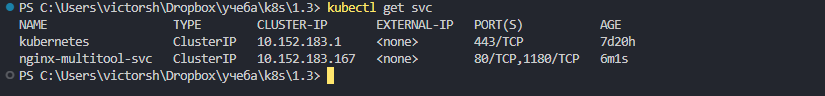
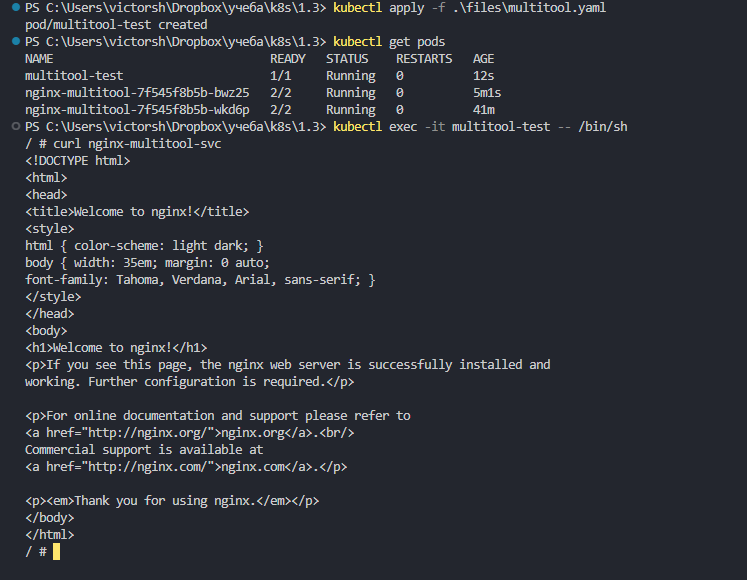
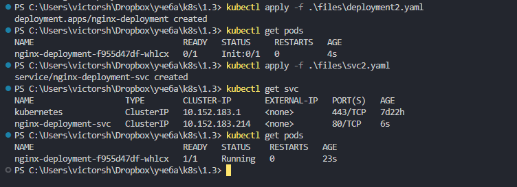

# Домашнее задание к занятию «Запуск приложений в K8S»

### Цель задания

В тестовой среде для работы с Kubernetes, установленной в предыдущем ДЗ, необходимо развернуть Deployment с приложением, состоящим из нескольких контейнеров, и масштабировать его.


------

### Задание 1. Создать Deployment и обеспечить доступ к репликам приложения из другого Pod

1. Создать Deployment приложения, состоящего из двух контейнеров — nginx и multitool. Решить возникшую ошибку.
создаем конфиги
[deployment.yaml](./files/deployment.yaml)

предсказанная проблема это конфликт портов. и nginx и mulititool используют 80\443 порты  

в документации mulititool  
``` 
You can pass additional parameter --namespace=<your-desired-namespace> to the above kubectl command. 
Due to a possibility of something (some service) already listening on port 80 and 443 on the worker nodes, the daemonset is configured to run multitool on port 1180 and 11443.   You can change this in the YAML file if you want.  
```

соответсвенно указываем параметр окружения для запуска мультитула на 1180  

в качестве полной цепочки решения  
``` 
kubectl describe pods nginx-multitool-64bddb88d-jglzd    
kubectl logs -p nginx-multitool-64bddb88d-jglzd -c multitool  
``` 
увидим конфликт   
2025/03/13 10:09:54 [emerg] 1#1: bind() to 0.0.0.0:80 failed (98: Address in use)  
nginx: [emerg] bind() to 0.0.0.0:80 failed (98: Address in use)  
разрешим его в конфиге  

``` 
kubectl apply -f .\files\deployment.yaml  
kubectl get pods  
kubectl describe pods nginx-multitool-64bddb88d-jglzd  
``` 


2. После запуска увеличить количество реплик работающего приложения до 2.
``` 
kubectl scale deployment nginx-multitool --replicas=2  
``` 
или меняем в yaml конфиге ( replicas: 2 ) и применяем его заново


3. Продемонстрировать количество подов до и после масштабирования.

kubectl get pods


4. Создать Service, который обеспечит доступ до реплик приложений из п.1.

создаем конфиг для сервиса  
[svc.yaml](./files/svc.yaml)  
применяем   
``` 
kubectl apply -f .\files\svc.yaml
``` 

проверяем   
``` 
kubectl get svc 
``` 
  


5. Создать отдельный Pod с приложением multitool и убедиться с помощью `curl`, что из пода есть доступ до приложений из п.1.

создаем конфиг для сервиса  
[svc.yaml](./files/multitool.yaml)  

применяем   
``` 
kubectl apply -f .\files\multitool.yaml 
``` 

подключаемся    
``` 
kubectl exec -it multitool-test -- /bin/sh  
curl nginx-multitool-svc    
``` 




------

### Задание 2. Создать Deployment и обеспечить старт основного контейнера при выполнении условий

1. Создать Deployment приложения nginx и обеспечить старт контейнера только после того, как будет запущен сервис этого приложения.
2. Убедиться, что nginx не стартует. В качестве Init-контейнера взять busybox.
3. Создать и запустить Service. Убедиться, что Init запустился.
4. Продемонстрировать состояние пода до и после запуска сервиса.

создаем конфиги deployments2 и svc2      
[deployments2.yaml](./files/deployment2.yaml)      
[svc2.yaml](./files/svc2.yaml)      

для проверки будем использовать цикл until в bash   
https://routerus.com/bash-until-loop/   

рботает так     
``` 
until ping 192.168.251.1&> /dev/null;   
do  
    echo "Waiting for the  host ...";   
    sleep 1;    
done;   
``` 
но мы использем nslookup памятую про то что Ip пода это нестабильная сущность.  

применяем   
``` 
kubectl apply -f .\files\deployment2.yaml
``` 

првоеряем состояние пода    
``` 
kubectl get pods    
``` 
он в состоянии init как и задумано  

``` 
kubectl apply -f .\files\svc2.yaml  
``` 
првоеряем состояние пода   
```  
kubectl get pods    
``` 



у меня при первых тестах не получилось  

проверка логов для разбора ошибок   
``` 
kubectl logs <pod-name> -c init-service
``` 
создание временного пода для првоерки   
``` 
kubectl run -it --rm --image=busybox dns-test --restart=Never -- sh 
``` 

проблема была изза того что я использовал nslookup, а он перебирает варианты FQDN.
пришлось задать FQDN явно. возможно улчше првоерять доступность портов сервиса


------
