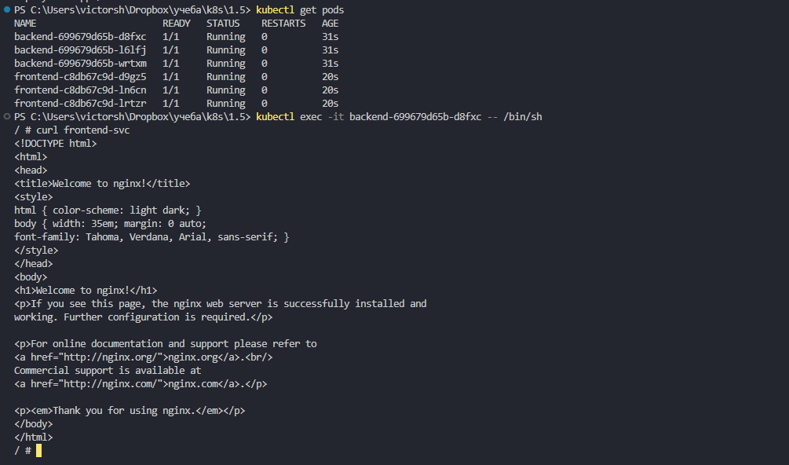
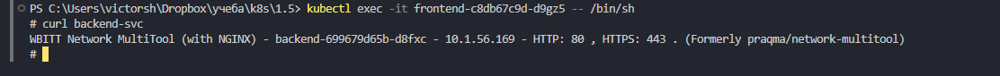
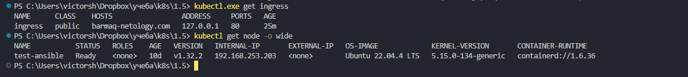
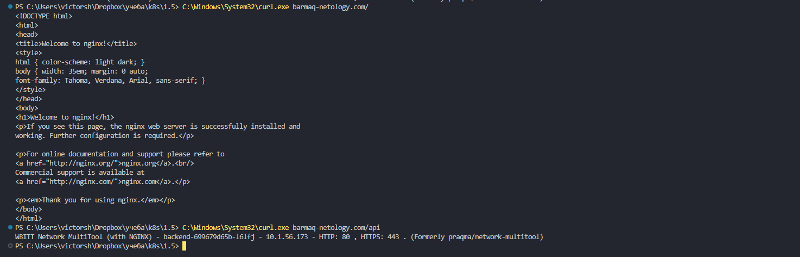

# Домашнее задание к занятию «Сетевое взаимодействие в K8S. Часть 2»

### Цель задания

В тестовой среде Kubernetes необходимо обеспечить доступ к двум приложениям снаружи кластера по разным путям.

------

------

### Задание 1. Создать Deployment приложений backend и frontend

1. Создать Deployment приложения _frontend_ из образа nginx с количеством реплик 3 шт.
2. Создать Deployment приложения _backend_ из образа multitool. 
3. Добавить Service, которые обеспечат доступ к обоим приложениям внутри кластера. 
4. Продемонстрировать, что приложения видят друг друга с помощью Service.
5. Предоставить манифесты Deployment и Service в решении, а также скриншоты или вывод команды п.4.


создаем манифесты		
[backend](./files/backend.yaml)		
[backend-svc](./files/backend-svc.yaml)		
[frontend](./files/frontend.yaml)		
[frontend-svc](./files/frontend-svc.yaml)		

создаем ресурсы используя манифесты, проверяем	
```	
kubectl apply -f .\files\backend-svc.yaml	
kubectl apply -f .\files\backend.yaml	
kubectl apply -f .\files\frontend-svc.yaml	
kubectl apply -f .\files\frontend.yaml	
kubectl get pods	
kubectl get deployments		
```	

проверяем frontend с backend	
```	
kubectl exec -it backend-699679d65b-d8fxc -- /bin/sh	
curl frontend-svc	
```	


проверяем backend с frontend	
```	
kubectl exec -it frontend-c8db67c9d-d9gz5 -- /bin/sh	
curl backend-svc	
```	


------

### Задание 2. Создать Ingress и обеспечить доступ к приложениям снаружи кластера

1. Включить Ingress-controller в MicroK8S.
2. Создать Ingress, обеспечивающий доступ снаружи по IP-адресу кластера MicroK8S так, чтобы при запросе только по адресу открывался _frontend_ а при добавлении /api - _backend_.
3. Продемонстрировать доступ с помощью браузера или `curl` с локального компьютера.
4. Предоставить манифесты и скриншоты или вывод команды п.2.


включаем ingress  контроллер на microk8s	
```		
microk8s enable ingress		
```

создаем манифест			
[ingress](./files/ingress.yaml)	
		
сздаем  и проверяем	
```
kubectl apply -f .\files\ingress.yaml		
kubectl.exe get ingress	
kubectl get node -o wide	
```
	

для проверки вносим в /etc/hosts 
```	
192.168.253.203 barmaq-netology.com	
```

првоеряем	
```
C:\Windows\System32\curl.exe barmaq-netology.com/	
C:\Windows\System32\curl.exe barmaq-netology.com/api
```	

полный путь с curl потому что при вызове в VS в Windows просто curl вызывается Invoke-WebRequest от PowerShell, для которого синтаксис будет отлbчаться	
	


------

