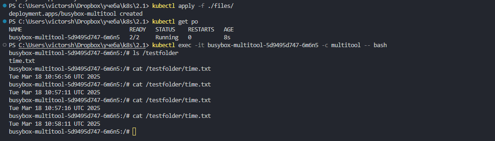
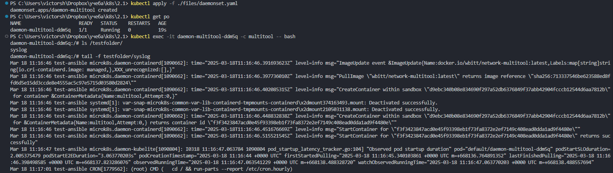

# Домашнее задание к занятию «Хранение в K8s. Часть 1»

### Цель задания

В тестовой среде Kubernetes нужно обеспечить обмен файлами между контейнерам пода и доступ к логам ноды.

------


### Задание 1 

**Что нужно сделать**

Создать Deployment приложения, состоящего из двух контейнеров и обменивающихся данными.

1. Создать Deployment приложения, состоящего из контейнеров busybox и multitool.
2. Сделать так, чтобы busybox писал каждые пять секунд в некий файл в общей директории.
3. Обеспечить возможность чтения файла контейнером multitool.
4. Продемонстрировать, что multitool может читать файл, который периодоически обновляется.
5. Предоставить манифесты Deployment в решении, а также скриншоты или вывод команды из п. 4.

создаем манифест	    		
[deployment](./files/deployment.yaml)  	

применяем  
```
kubectl apply -f ./files/deployment.yaml  
kubectl get po  
```

проверяем 		  
```
kubectl exec -it busybox-multitool-5d9495d747-6m6n5 -c multitool -- bash  
ls /testfolder  
cat /testfolder/time.txt  
cat /testfolder/time.txt  
```

видим что записи в /testfolder/time.txt в контейнере multitool обновляется контейнером busybox  
  

------

### Задание 2

**Что нужно сделать**

Создать DaemonSet приложения, которое может прочитать логи ноды.

1. Создать DaemonSet приложения, состоящего из multitool.
2. Обеспечить возможность чтения файла `/var/log/syslog` кластера MicroK8S.
3. Продемонстрировать возможность чтения файла изнутри пода.
4. Предоставить манифесты Deployment, а также скриншоты или вывод команды из п. 2.


создаем манифест	    		
[daemonset](./files/daemonset.yaml)  	

применяем  
```
kubectl apply -f ./files/daemonset.yaml
kubectl get po
```

проверяем 		  
```
kubectl exec -it daemon-multitool-ddm5q -c multitool -- bash  
ls /testfolder/
tail -f /testfolder/syslog
```
видим содержимое syslog  ноды test-ansible
 


------
