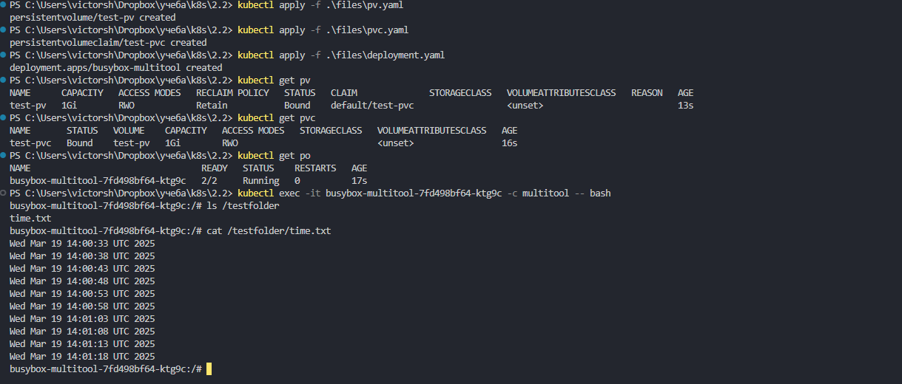
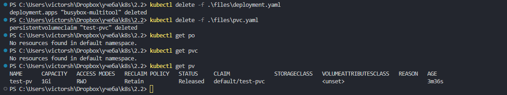
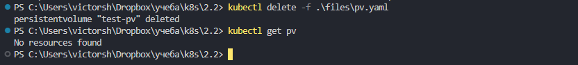
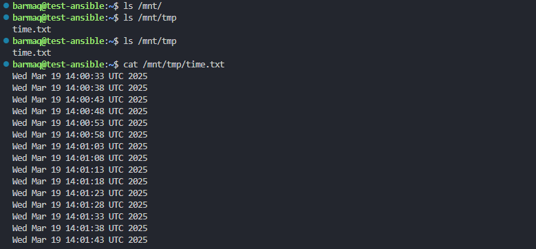
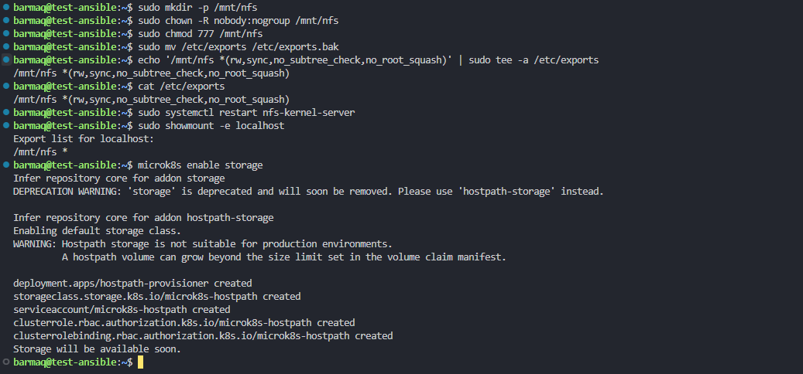
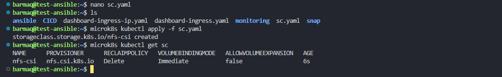
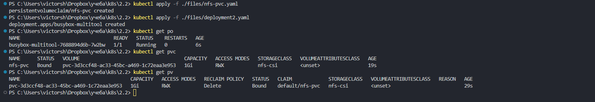
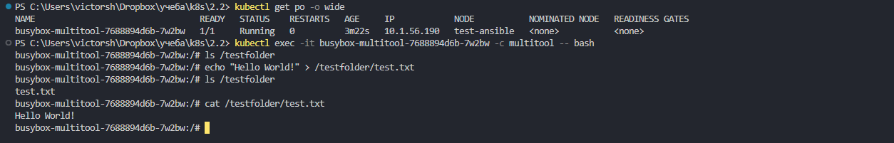

# Домашнее задание к занятию «Хранение в K8s. Часть 2»

### Цель задания

В тестовой среде Kubernetes нужно создать PV и продемострировать запись и хранение файлов.

------

### Задание 1

**Что нужно сделать**

Создать Deployment приложения, использующего локальный PV, созданный вручную.

1. Создать Deployment приложения, состоящего из контейнеров busybox и multitool.

манифест [Deployment](./files/deployment.yaml)   

2. Создать PV и PVC для подключения папки на локальной ноде, которая будет использована в поде.

манифест [pv](./files/pv.yaml)    
манифест [pvc](./files/pvc.yaml)   

3. Продемонстрировать, что multitool может читать файл, в который busybox пишет каждые пять секунд в общей директории. 

применяем манифесты  
```
kubectl apply -f .\files\pv.yaml  
kubectl apply -f .\files\pvc.yaml  
kubectl apply -f .\files\deployment.yaml  
```

проверяем  
```
kubectl get pv  
kubectl get pvc  
kubectl get po   
```

обращаем внимание на статус pv - Bound означает что произошла связка с pvc  

читаем файл от busybox:  
```
kubectl exec -it busybox-multitool-7fd498bf64-ktg9c -c multitool -- bash    
ls /testfolder  
cat /testfolder/time.txt  
```

 

4. Удалить Deployment и PVC. Продемонстрировать, что после этого произошло с PV. Пояснить, почему.

удаляем и проверяем  
```
kubectl delete -f .\files\deployment.yaml  
kubectl delete -f .\files\pvc.yaml  

kubectl get po  
kubectl get pvc  
kubectl get pv  
```
   

статус pv изменился на Released  
pod использовавший наше pvc был удален. никакой процесс больше не использовался самим pvc , это позволило нам его так же удалить.  
при этом пропала связь между pvc и pv и pv теперь можно связать с другим, подходящим по условиям  pvc  

5. Продемонстрировать, что файл сохранился на локальном диске ноды. Удалить PV.  Продемонстрировать что произошло с файлом после удаления PV. Пояснить, почему.

на ноде  
```
ls /mnt/tmp
```
   

теперь  
```
kubectl delete -f .\files\pv.yaml  
kubectl get pv  
No resources found  
```
   

снова проверяем на ноде  
``` 
ls /mnt/tmp  
```

 

файл и его содержимое будет там присутствовать без изменений. происходит это потому что pv позволяет лишь поулчить доступ к хранилищу , при этом им не являясь. 
Поэтому с файлами ничего не произошло , даже после удаления pv


------

### Задание 2

**Что нужно сделать**

Создать Deployment приложения, которое может хранить файлы на NFS с динамическим созданием PV.

1. Включить и настроить NFS-сервер на MicroK8S.

настраиваем nfs шару и sc microk8s по инструкции  
https://microk8s.io/docs/how-to-nfs  

манифест sc  
   

проверяем 
```
kubectl get storageclasses  
```
   
   
   


2. Создать Deployment приложения состоящего из multitool, и подключить к нему PV, созданный автоматически на сервере NFS.

манифест deployment  
   
манифест PVC  
   

создаем ресурсы и проверяем  
```
kubectl apply -f ./files/nfs-pvc.yaml  
kubectl apply -f ./files/deployment2.yaml  
kubectl get po  
kubectl get pvc  
kubectl get pv  
```

   

3. Продемонстрировать возможность чтения и записи файла изнутри пода. 

подключаемся к контейнеру  
```
kubectl get po -o wide   
kubectl exec -it busybox-multitool-7688894d6b-7w2bw -c multitool -- bash   
```

првоеряем  
```
ls /testfolder  
echo "Hello World!" > /testfolder/test.txt  
ls /testfolder  
cat /testfolder/test.txt  
```
 

проверяем так же на ноде с шарой  
```
cat /mnt/nfs/pvc-3d3ccf48-ac33-45bc-a469-1c72eaa3e953/test.txt   
Hello World!  
```
 

4. Предоставить манифесты, а также скриншоты или вывод необходимых команд.


------
