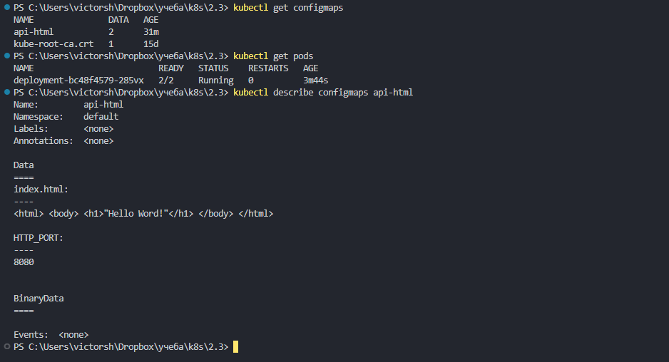
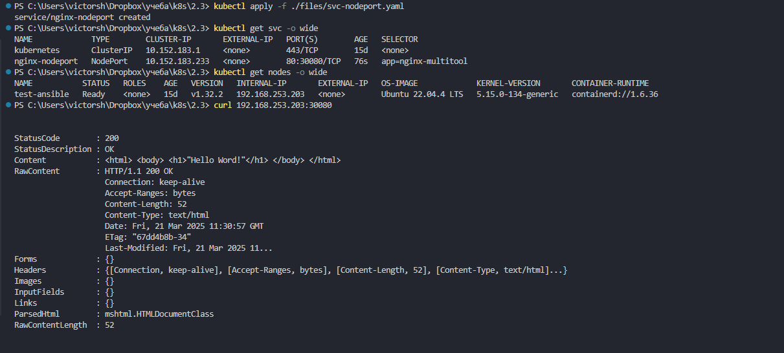
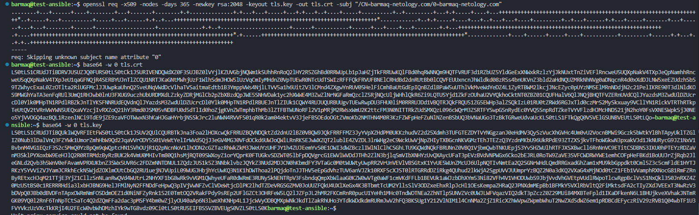
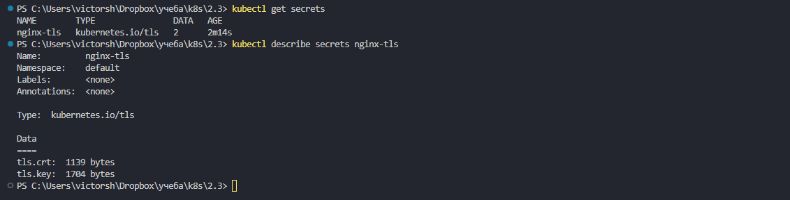
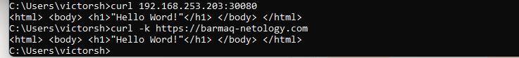

# Домашнее задание к занятию «Конфигурация приложений»

### Цель задания

В тестовой среде Kubernetes необходимо создать конфигурацию и продемонстрировать работу приложения.

------

### Задание 1. Создать Deployment приложения и решить возникшую проблему с помощью ConfigMap. Добавить веб-страницу

1. Создать Deployment приложения, состоящего из контейнеров nginx и multitool.  
2. Решить возникшую проблему с помощью ConfigMap.
3. Продемонстрировать, что pod стартовал и оба конейнера работают.
4. Сделать простую веб-страницу и подключить её к Nginx с помощью ConfigMap. Подключить Service и показать вывод curl или в браузере.
5. Предоставить манифесты, а также скриншоты или вывод необходимых команд.

создаем манифесты
[api-html](./files/sc.yaml)     
[deployment](./files/sc.yaml)  
[svc-nodeport](./files/svc-nodeport.yaml)    

проблема в использовании 80го порта обоими контейнерами.
передаем env перменную используя ConfigMap
так же через ConfigMap передаем файл index.html  в базовое расположение nginx с содержимым "Hello word!" ( да, ошибся с буквой :) зато видно что свое )  

создаем ресурсы :  
kubectl apply -f ./files/api-html.yaml  
kubectl apply -f ./files/deployment.yaml  
kubectl apply -f ./files/svc-nodeport.yaml  

проверяем  

```
kubectl get nodes -o wide  
curl 192.168.253.203:30080  
```

   
   


------

### Задание 2. Создать приложение с вашей веб-страницей, доступной по HTTPS 

1. Создать Deployment приложения, состоящего из Nginx.
2. Создать собственную веб-страницу и подключить её как ConfigMap к приложению.
3. Выпустить самоподписной сертификат SSL. Создать Secret для использования сертификата.
4. Создать Ingress и необходимый Service, подключить к нему SSL в вид. Продемонстировать доступ к приложению по HTTPS. 
4. Предоставить манифесты, а также скриншоты или вывод необходимых команд.

создаем самоподписанный сертификат 
```
openssl req -x509 -nodes -days 365 -newkey rsa:2048 -keyout tls.key -out tls.crt -subj "/CN=barmaq-netology.com/0=barmaq-netology.com"  
```
кодируем  в base64  
```
base64 -w 0 tls.crt  
base64 -w 0 tls.key  
```
   


создаем манифесты  
следим чтобы не было лишних пробелов в конце ключей в секретах!  


[secret-tls](./files/secret-tls.yaml)     
[api-html](./files/api-html.yaml)     
[deployment2](./files/deployment2.yaml)     
[svc-nodeport](./files/svc-nodeport.yaml)     
[ingress](./files/ingress.yaml)    

создаем ресурсы. configmaps в первую очередь  
```
kubectl apply -f ./files/secret-tls.yaml  
kubectl apply -f ./files/api-html.yaml  
kubectl apply -f ./files/deployment2.yaml  
kubectl apply -f ./files/svc-nodeport.yaml  
kubectl apply -f ./files/ingress.yaml   
```

проверяем  секреты  
```
kubectl get secrets  
kubectl describe secrets nginx-tls  
```
   


проверяем доступ. с ключем -k ( потому что сертификат самоподписанный )  
```
curl -k https://barmaq-netology.com  
```
   

------
