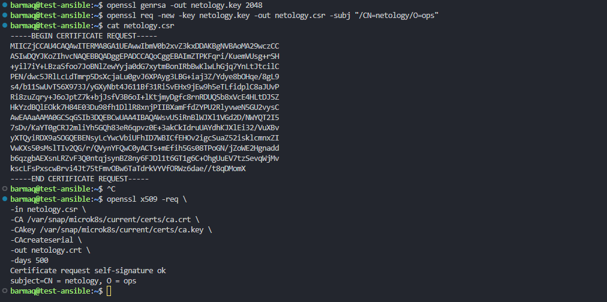
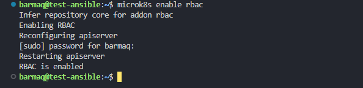
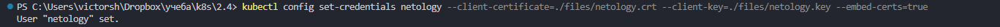
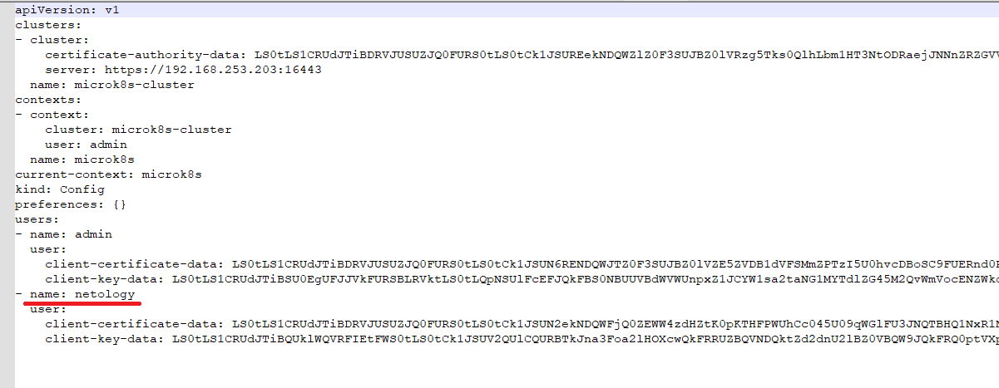
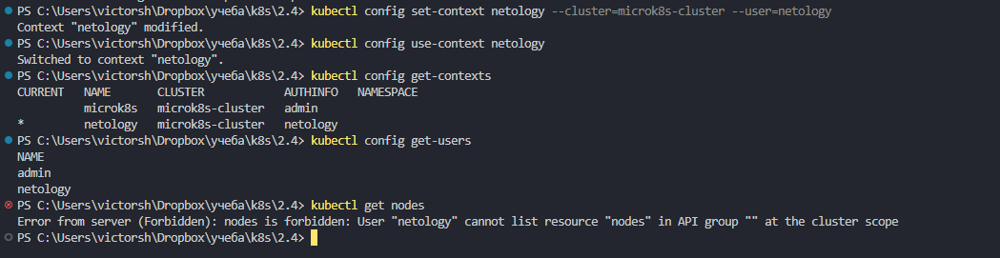
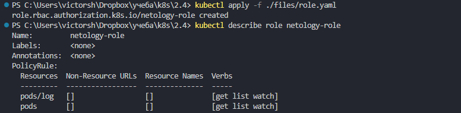
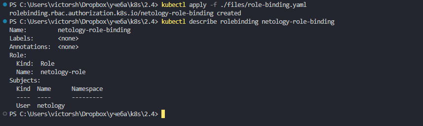
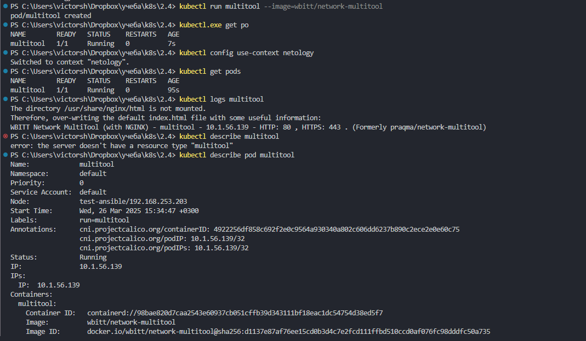
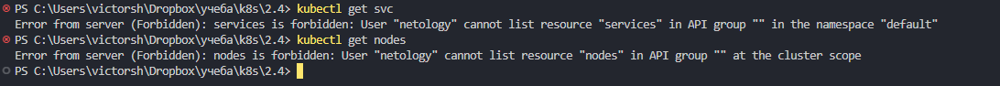

# Домашнее задание к занятию «Управление доступом»

### Цель задания

В тестовой среде Kubernetes нужно предоставить ограниченный доступ пользователю.

------

### Задание 1. Создайте конфигурацию для подключения пользователя

1. Создайте и подпишите SSL-сертификат для подключения к кластеру.
2. Настройте конфигурационный файл kubectl для подключения.
3. Создайте роли и все необходимые настройки для пользователя.
4. Предусмотрите права пользователя. Пользователь может просматривать логи подов и их конфигурацию (`kubectl logs pod <pod_id>`, `kubectl describe pod <pod_id>`).
5. Предоставьте манифесты и скриншоты и/или вывод необходимых команд.

### Решение 1

1. Создайте и подпишите SSL-сертификат для подключения к кластеру.

все стал генерить на сервере, поскольку все мое. но в реальных услових запрос генерился бы клиентом, подписывал бы администратор на сервере  
на кластере :  

создаем ключ  
```
openssl genrsa -out netology.key 2048  
 ``` 
теперь запрос на создание серта. subject это имя пользователя  
```
openssl req -new -key netology.key -out netology.csr -subj "/CN=netology/O=ops"  
```

смотрим  
```
cat netology.csr  
```
    
нужно выпустить ключ сроком жизни до 500 дней  
```
openssl x509 -req \  
-in netology.csr \  
-CA /var/snap/microk8s/current/certs/ca.crt \  
-CAkey /var/snap/microk8s/current/certs/ca.key \  
-CAcreateserial \  
-out netology.crt \  
-days 500  
```

итоговые netology.crt и netology.key передаем клиенту  
я забираю на клиенте при помощи scp  
```
scp barmaq@192.168.253.203:/home/barmaq/netology.crt ./files/netology.crt  
scp barmaq@192.168.253.203:/home/barmaq/netology.key ./files/netology.key  
```

  

  
2. Настройте конфигурационный файл kubectl для подключения.


включаем на кластере  
```
microk8s enable rbac  
```

  

на клиенте  
создадим нового юзера через kubectl  
```
kubectl config set-credentials netology --client-certificate=./files/netology.crt --client-key=./files/netology.key --embed-certs=true  
```

  

проверяем  
```
cat ~./kube/config  
```
появился дополнительный пользователь - name: netology  

  


теперь нужно создать новый контекст  
```
kubectl config set-context netology --cluster=microk8s-cluster --user=netology  
kubectl config use-context netology  
kubectl config get-contexts  
kubectl config get-users  
```
проверяем  
```
kubectl get nodes   
```
доступа нет. все правильно  

  


3. Создайте роли и все необходимые настройки для пользователя.

добавляем роли и права  

переключаемся обратно на пользователя с полными правами  
```
kubectl config use-context microk8s  
```

создаем роль   
[role.yaml](./files/role.yaml)  

```
kubectl apply -f ./files/role.yaml  
```
проверим   
```
kubectl describe role netology-role  
```

  

теперь надо создать role-binding  
[role-binding.yaml](./files/role-binding.yaml)  

```  
kubectl apply -f ./files/role-binding.yaml  
```
проверим  
```
kubectl describe rolebinding netology-role-binding  
```

  

4. Предусмотрите права пользователя. Пользователь может просматривать логи подов и их конфигурацию (`kubectl logs pod <pod_id>`, `kubectl describe pod <pod_id>`).

в манифесте роли мы дали доступ к ресурсам pods и pods/log и к операциям  get, list, watch  

создаем под для проверки   
```
kubectl run multitool --image=wbitt/network-multitool  
```

переключаемся на пользователя netology  
```
kubectl config use-context netology  
```

проверяем  
```
kubectl get pods  
kubectl logs multitool  
kubectl describe multitool  
```

  


пробуем посмотреть что то из ресурсов вне рамок роли  

```
kubectl get svc  
kubectl get nodes   
```

получаем сообщение о ограничении в правах. так и задумано.   

  

------
