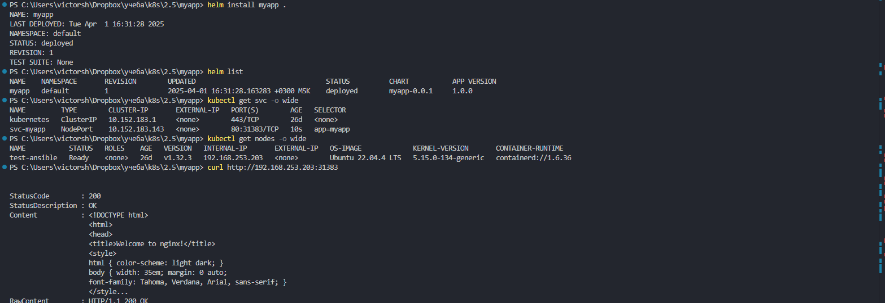
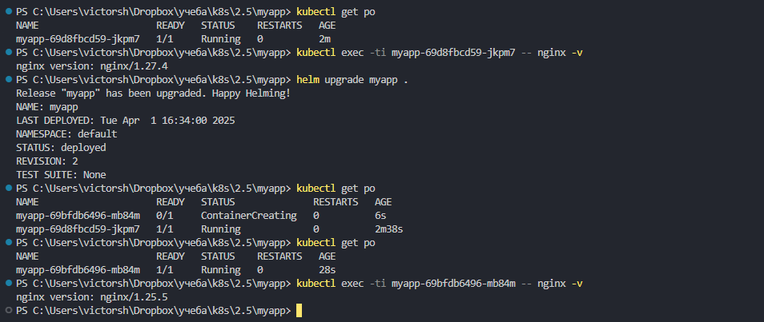
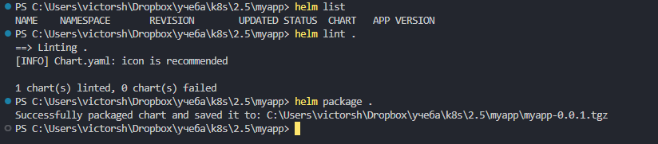
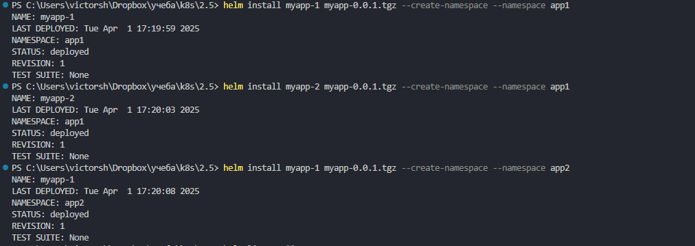
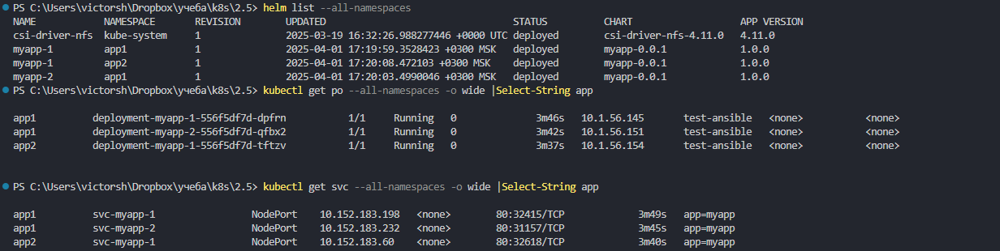

# Домашнее задание к занятию «Helm»

### Цель задания

В тестовой среде Kubernetes необходимо установить и обновить приложения с помощью Helm.


------

### Задание 1. Подготовить Helm-чарт для приложения

1. Необходимо упаковать приложение в чарт для деплоя в разные окружения. 
2. Каждый компонент приложения деплоится отдельным deployment’ом или statefulset’ом.


создаем чарт:  
```
helm create myapp  
```
  

наполняем манифестами, удаляем ненужное.  
[myapp](./myapp/)  

проверяем и запускаем  
```
helm template myapp .  
helm install myapp .  
```
или если чарт уже существует - обновляем
```
helm upgrade myapp .  
```
првоеряем :  
```
kubectl get svc -o wide   
kubectl get nodes -o wide  
curl http://192.168.253.203:30285  
```
  

3. В переменных чарта измените образ приложения для изменения версии.

меняем tag в файле [values](./myapp/values.yaml) , потом проверям текущую версию:  

```
kubectl get po  
kubectl exec -ti myapp-69d8fbcd59-jkpm7 -- nginx -v  
```

апгрейдим чарт и снова проверяем версию  
```
helm upgrade myapp .  
kubectl get po  
kubectl exec -ti myapp-69bfdb6496-mb84m -- nginx -v  
```
видим что версия изменилась на 1.25  
  


------
### Задание 2. Запустить две версии в разных неймспейсах

1. Подготовив чарт, необходимо его проверить. Запуститe несколько копий приложения.
2. Одну версию в namespace=app1, вторую версию в том же неймспейсе, третью версию в namespace=app2.
3. Продемонстрируйте результат.

подготавливаем чарт и проверяем 
валидируем синтаксис  
```
helm lint .    
```
упаковываем  
```
helm package .  
```
  


запускаем в разных неймспейсах. в пределах одного неймспейса даем уникальные(!) имена:  
```
helm install myapp-1 myapp-0.0.1.tgz --create-namespace --namespace app1  
helm install myapp-2 myapp-0.0.1.tgz --create-namespace --namespace app1  
helm install myapp-1 myapp-0.0.1.tgz --create-namespace --namespace app2  
```
  

проверяем:  
```
helm list --all-namespaces  
kubectl get po --all-namespaces -o wide |grep app  
kubectl get svc --all-namespaces -o wide |grep app  
```

у меня helm и kubectl под windows , поэтому :  
```
helm list --all-namespaces  
kubectl get po --all-namespaces -o wide |Select-String app  
kubectl get svc --all-namespaces -o wide |Select-String app  
```
  

### 
