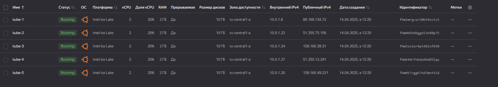
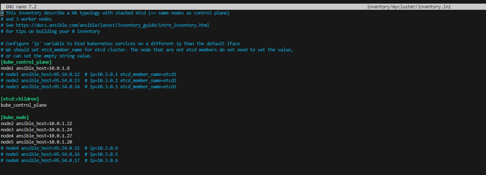
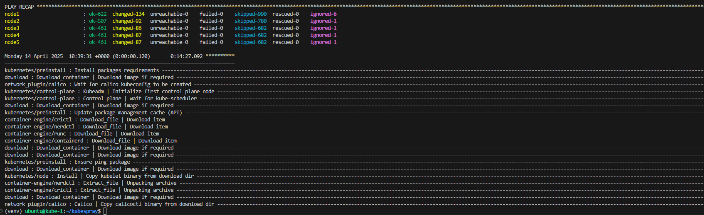
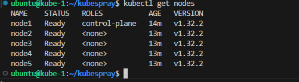
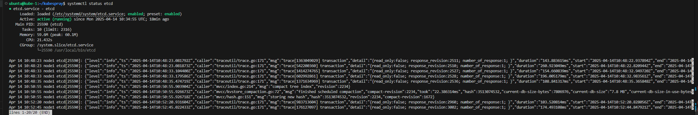

# Домашнее задание к занятию «Установка Kubernetes»

### Цель задания

Установить кластер K8s.

### Чеклист готовности к домашнему заданию

1. Развёрнутые ВМ с ОС Ubuntu 20.04-lts.


### Инструменты и дополнительные материалы, которые пригодятся для выполнения задания

1. [Инструкция по установке kubeadm](https://kubernetes.io/docs/setup/production-environment/tools/kubeadm/create-cluster-kubeadm/).
2. [Документация kubespray](https://kubespray.io/).

-----

### Задание 1. Установить кластер k8s с 1 master node

1. Подготовка работы кластера из 5 нод: 1 мастер и 4 рабочие ноды.
2. В качестве CRI — containerd.
3. Запуск etcd производить на мастере.
4. Способ установки выбрать самостоятельно.

### Правила приёма работы

1. Домашняя работа оформляется в своем Git-репозитории в файле README.md. Выполненное домашнее задание пришлите ссылкой на .md-файл в вашем репозитории.
2. Файл README.md должен содержать скриншоты вывода необходимых команд `kubectl get nodes`, а также скриншоты результатов.
3. Репозиторий должен содержать тексты манифестов или ссылки на них в файле README.md.


### Решение

1. Подготовка работы кластера из 5 нод: 1 мастер и 4 рабочие ноды.

создаем при помощи terraform 5 виртуалок    
kube-1  
...  
kube-5 

  

добавляем ключ в агент 
```
ssh-add C:\Users\victor\.ssh\ycbarmaq.rsa  
```

копируем ключ на будущую мастер ноду ( ставить будем с нее ) 
```
scp C:\Users\victor\.ssh\ycbarmaq.rsa ubuntu@89.169.134.72:.ssh/ycbarmaq.rsa  
```

настраиваем ssh к другим серверам ( или указываем ключ в анисбл )  
```
eval "$(ssh-agent -s)"  
ssh-add /home/ubuntu/.ssh/ycbarmaq.rsa  
chmod 600 /home/ubuntu/.ssh/ycbarmaq.rsa  
```

подключаемся к системе, обновляем и скачиваем роль, запускаем вирт окружение питона
```
ssh ubuntu@89.169.134.72  
apt-get update   
git clone https://github.com/kubernetes-sigs/kubespray  
cd kubespray/  
sudo apt install python3.12-venv 
python3 -m venv venv  
source venv/bin/activate  
```

ставим зависимости  
```
pip3 install -r requirements.txt  
```

копируем из примера инвентарь, конфигурируем  
```
cp -rfp inventory/sample inventory/mycluster
nano inventory/mycluster/inventory.ini
```
  
[inventory.ini](./files/inventory.ini)  
ждем примерно 10 минут и установка успешно завершена!   
  

запускаем  
```
ansible-playbook -i inventory/mycluster/inventory.ini cluster.yml -b -v  
```

добавляем настройки кубадмин  
```
mkdir -p $HOME/.kube
sudo cp -i /etc/kubernetes/admin.conf $HOME/.kube/config
sudo chown $(id -u):$(id -g) $HOME/.kube/config
```


проверяем  
```
kubectl get nodes
```

  


2. В качестве CRI — containerd.  

в плейбуке  
/home/ubuntu/kubespray/inventory/mycluster/group_vars/k8s_cluster/k8s-cluster.yml  
указано  
```
container_manager: containerd  
```
3. Запуск etcd производить на мастере.  

в инвентори файле указано :  
```
[etcd:children]
kube_control_plane
```

проверяем на мастер ноде  
```
systemctl status etcd
```

  

4. Способ установки выбрать самостоятельно.
Выбран Kubespray