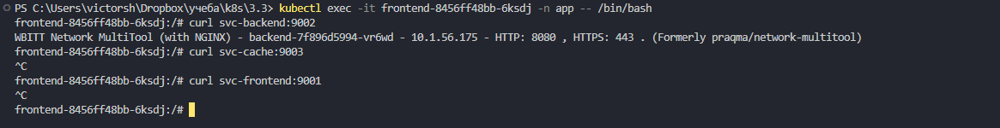

# Домашнее задание к занятию «Как работает сеть в K8s»

### Цель задания

Настроить сетевую политику доступа к подам.

### Чеклист готовности к домашнему заданию

1. Кластер K8s с установленным сетевым плагином Calico.

### Инструменты и дополнительные материалы, которые пригодятся для выполнения задания

1. [Документация Calico](https://www.tigera.io/project-calico/).
2. [Network Policy](https://kubernetes.io/docs/concepts/services-networking/network-policies/).
3. [About Network Policy](https://docs.projectcalico.org/about/about-network-policy).

-----

### Задание 1. Создать сетевую политику или несколько политик для обеспечения доступа

1. Создать deployment'ы приложений frontend, backend и cache и соответсвующие сервисы.
2. В качестве образа использовать network-multitool.
3. Разместить поды в namespace App.
4. Создать политики, чтобы обеспечить доступ frontend -> backend -> cache. Другие виды подключений должны быть запрещены.
5. Продемонстрировать, что трафик разрешён и запрещён.

### Решение

# Создадим манифесты  
deployments:  
[frontend](./files/frontend.yaml)  
[backend](./files/backend.yaml)  
[tecachet](./files/cache.yaml)  

network policy:  
[np](./files/policy.yaml)  

services:  
[svc-frontend](./files/svc-frontend.yaml)  
[svc-backend](./files/svc-backend.yaml)  
[svc-cache](./files/svc-cache.yaml)  

# подготавливаем namespace и применяем манифесты  
```
kubectl create namespace app  
kubectl apply -f ./files/  
```

# проверяем созданные ресурсы  
```
kubectl get po -o wide -n app
kubectl get deployments -o wide -n app
kubectl get svc -o wide -n app
kubectl get networkpolicies -n app
```

  

# проверяем работу сетевых политик  

frontend-backend  
```
kubectl exec -it frontend-8456ff48bb-6ksdj -n app -- /bin/bash  
curl svc-frontend:9001  
curl svc-backend:9002  
curl svc-cache:9003  
```
  

видим чтто доступен только backend

backend-cache  
```
kubectl exec -it backend-7f896d5994-vr6wd -n app -- /bin/bash  
curl svc-frontend:9001  
curl svc-backend:9002  
curl svc-cache:9003  
```

  

видим чтто доступен только cache


cache ко всем  
```
kubectl exec -it cache-57dc4df9d4-swsgw -n app -- /bin/bash  
curl svc-frontend:9001  
curl svc-backend:9002  
curl svc-cache:9003  
```

  

видим что ни один сервис не отвечает


