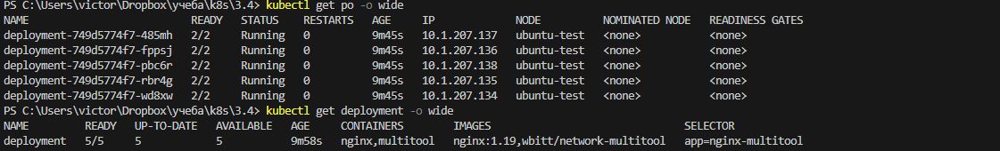
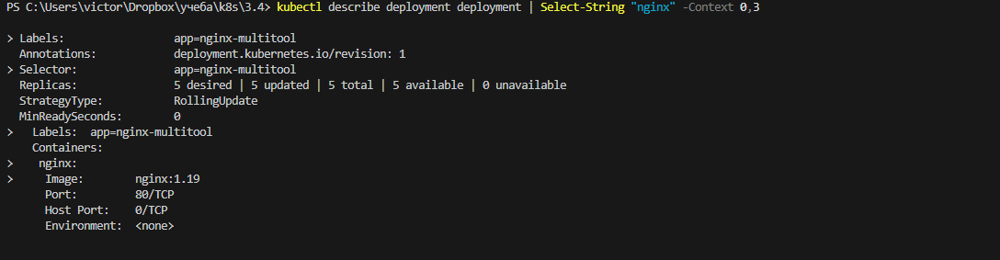
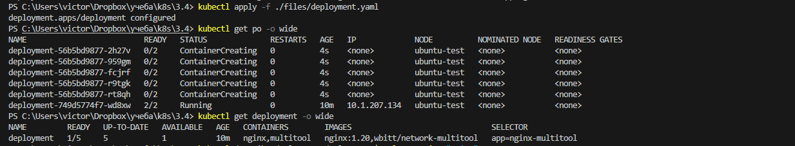
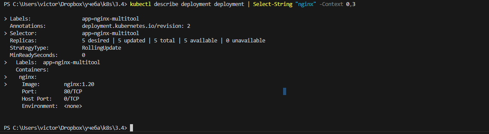
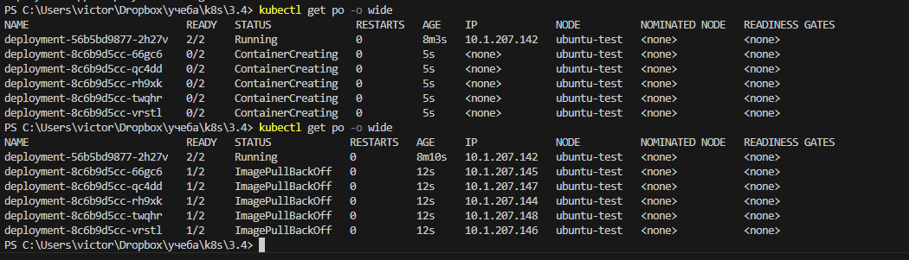
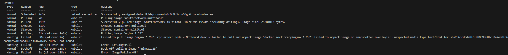
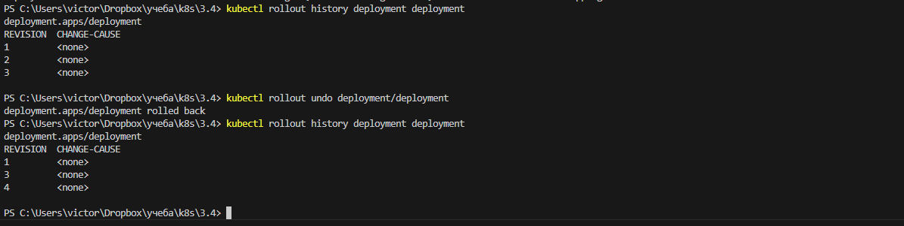
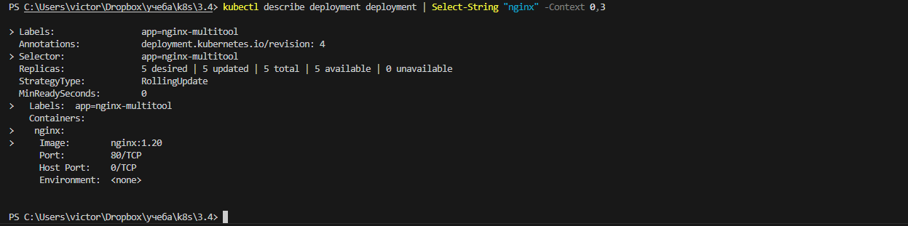

# Домашнее задание к занятию «Обновление приложений»

### Цель задания

Выбрать и настроить стратегию обновления приложения.

### Чеклист готовности к домашнему заданию

1. Кластер K8s.

### Инструменты и дополнительные материалы, которые пригодятся для выполнения задания

1. [Документация Updating a Deployment](https://kubernetes.io/docs/concepts/workloads/controllers/deployment/#updating-a-deployment).
2. [Статья про стратегии обновлений](https://habr.com/ru/companies/flant/articles/471620/).

-----

### Задание 1. Выбрать стратегию обновления приложения и описать ваш выбор

1. Имеется приложение, состоящее из нескольких реплик, которое требуется обновить.
2. Ресурсы, выделенные для приложения, ограничены, и нет возможности их увеличить.
3. Запас по ресурсам в менее загруженный момент времени составляет 20%.
4. Обновление мажорное, новые версии приложения не умеют работать со старыми.
5. Вам нужно объяснить свой выбор стратегии обновления приложения.

### Задание 1. Решение 

Если возможен простой приложения  то мы можем обновиться через recreate.  
Но тут мы терияем время когда поды не будут существовать, а так же, время необходимое на возмоный откат в случает проблем.  

Но мне кажется тут лучше бы пошла стратегия green-blue.  
Мы бы подняли сначала дополнительный deployment c ододной репликой новой версии и проверили бы работу создав отдельный сервис или используя селектор. При необходимости уменьшили бы количество реплик предыдущей версии.
Если все в порядке, то переключили бы пользователей на новую версию и увеличили бы количество реплик новой версии, параллельно удалив или уменьшив до минимума реплик старую версию deployment


### Задание 2. Обновить приложение

1. Создать deployment приложения с контейнерами nginx и multitool. Версию nginx взять 1.19. Количество реплик — 5.
2. Обновить версию nginx в приложении до версии 1.20, сократив время обновления до минимума. Приложение должно быть доступно.
3. Попытаться обновить nginx до версии 1.28, приложение должно оставаться доступным.
4. Откатиться после неудачного обновления.

### Задание 2. Решение

#### Создаем манифест с указанными в задаче параметрами  

[deployment](./files/deployment.yaml)  

применяем манифест.  
```
kubectl apply -f ./files/deployment.yaml  
```

проверяем версию  
```
kubectl get po -o wide  
kubectl get deployment -o wide  
kubectl describe deployment deployment | grep -A2 "Containers" | grep "nginx"  
```

поскольку у меня windows то  
```
kubectl describe deployment deployment | Select-String "nginx" -Context 0,3  
```  

*мы можем увидеть версию nginx при выводе get deployment в колонке images. но ориентироваться на нее будет неудобно, если имена образов длинные или х несколько в поде  

  

  

#### обновляем до версии nginx:1.20  


меняем в манифесте версию  
```
image: nginx:1.20  
```  

добавляем блок со стратегией обновления   
параметры maxUnavailable и maxSurge выставляем на значения необходимые для максимально быстрого апдейта ( не рекомендовал бы в продакшене) 

```
  strategy:  
    type: RollingUpdate  
    rollingUpdate:  
      maxUnavailable: 4  
      maxSurge: 100%  
```


применяем и повторяем  проверку  
```
kubectl apply -f ./files/deployment.yaml  
kubectl get po -o wide  
kubectl get deployment -o wide  
```

видим что поды начали пересоздаваться  

  

ждем завершения процесса и проверяем версию  
```
kubectl describe deployment deployment | Select-String "nginx" -Context 0,3  
```

  

#### пытаемся обновиться до версии nginx:1.28 

теперь обновляемся до несуществующщей версии   
мсеняем версию на  
```
image: nginx:1.28  
```

пытаемся применить 

```
kubectl apply -f ./files/deployment.yaml  
kubectl get po -o wide  
```

  

видим что поды не поднимаются изза ошибки ImagePullBackOff в одном из контейнеров.  
проверяем с каким именно подом проблема ( предпологается что мы не знаем что привело к ошибке )  

```
kubectl describe po deployment-8c6b9d5cc-66gc6
```  
выдим в событиях ошибку при попытке запулить образ nginx:1.28  
```
Failed to pull image "nginx:1.28": rpc error: code = NotFound  
```  

  

#### Откатываемся после неудачного обновления.

смотрим историю обновлений  
```
kubectl rollout history deployment deployment  
```
откатываемся  
``` 
kubectl rollout undo deployment/deployment
```

  

проверяем версию nginx  
```
kubectl describe deployment deployment | Select-String "nginx" -Context 0,3
```

она снова 1.20  

  
