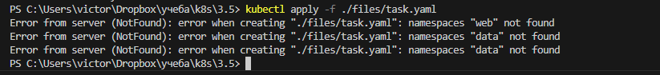
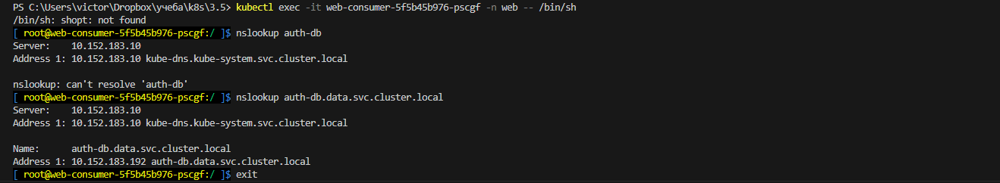
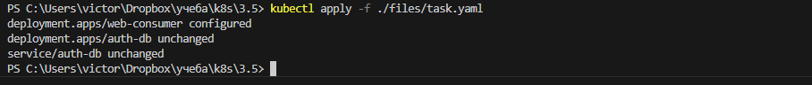
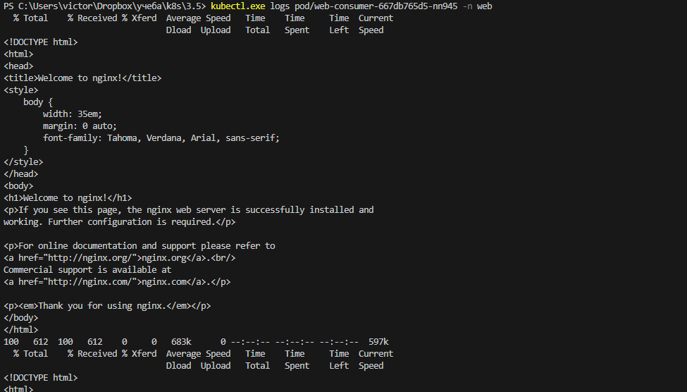

# Домашнее задание к занятию Troubleshooting

### Цель задания

Устранить неисправности при деплое приложения.

### Чеклист готовности к домашнему заданию

1. Кластер K8s.

### Задание. При деплое приложение web-consumer не может подключиться к auth-db. Необходимо это исправить

1. Установить приложение по команде:
```shell
kubectl apply -f https://raw.githubusercontent.com/netology-code/kuber-homeworks/main/3.5/files/task.yaml
```
2. Выявить проблему и описать.
3. Исправить проблему, описать, что сделано.
4. Продемонстрировать, что проблема решена.

### Решение

скачал репозиторий ( чтобы можно было менять манифест ). запускаем манифест  
```
kubectl apply -f ./files/task.yaml
```

видим предупреждение о отсутсвующих namespace  

  

создаем неймпспейсы :  
```
kubectl create namespace web
kubectl create namespace data
```

применяем снова  
```
kubectl apply -f ./files/task.yaml
```

и deployments и service  успешно запускаются  
но, поскольку у нас разные неймспейсы то в deployment web-consumer вместо 
```
curl auth-db
```
нужно указывать 
```
curl auth-db.data.svc.cluster.local
```
т е FQDN 

проверяем это прямо на запущенном поде  
```
kubectl exec -it web-consumer-5f5b45b976-pscgf -n web -- /bin/bash  
nslookup auth-db
```

не может зарезолвиться  
```
nslookup auth-db.data.svc.cluster.local  
```
работает!  

  

меняем команду curl в манифесте на вариант с FQDN, применяем  
```
kubectl apply -f ./files/task.yaml 
```
проверяем на наличие проблем  
```
kubectl.exe logs pod/web-consumer-667db765d5-nn945 -n web  
```
видим что все отлично!  

  
  


исправленный манифест 
[task.yaml](./files/task.yaml)  

PS.  правильнее, наверное было сначала запустить kubectl logs, увидеть ошибку ресловинга и плясать от этого, но это стало очевидным на стадии добавления неймспейсов.  

лично для себя - сам бы поменял имя сервиса. чтобы он не совпадал с именем Deployment.  
хоть это позволительно в даной ситуации ( ресурсы разные ), но неудобно. удобнее  было бы назвать сервис auth-db-svc  


